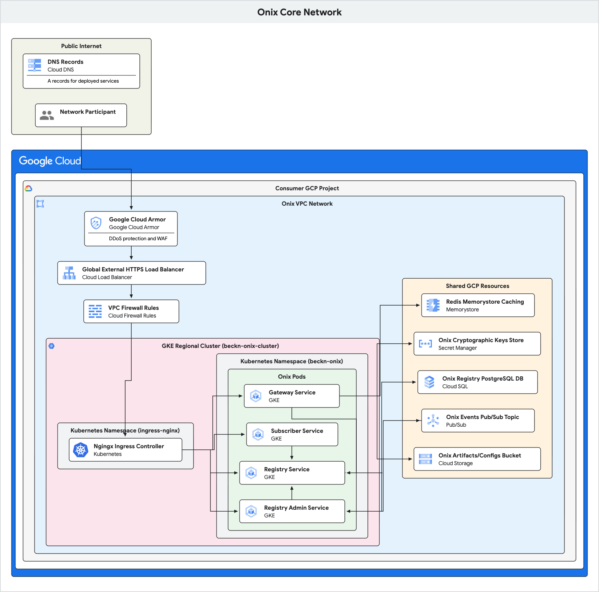
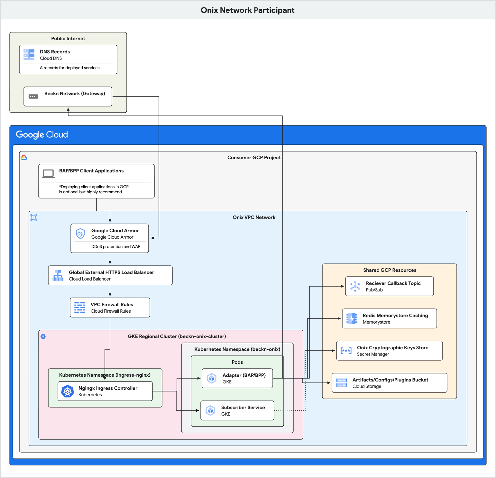

# DPI Accelerator - BECKN-ONIX

This suite of open-source software accelerates the adoption of Digital Public Infrastructure (DPI). It provides a "DPI-as-a-Service" (DaaS) model with pre-packaged, cloud-ready components that allow nations to rapidly launch DPI pilots and bypass lengthy and costly traditional procurement and build cycles. The suite includes products like the Beckn Onix open network accelerator (GA) and ADK-based conversational agents (in private preview). Each deployment is an application layer innovation built on GCP stack, driving consumption of core infrastructure, data services, and advanced AI capabilities.

This project contains the core components for setting up a Beckn-compliant network, including the Registry, Gateway, BAP Adapter and BPP Adapter. It provides a foundational framework to facilitate seamless interaction and data exchange within the Beckn Protocol ecosystem.

Onix is a complete solution for deploying a Beckn network on Google Cloud. 
Beckn is an open protocol that enables location-aware, local commerce across industries. It allows consumers and providers to discover each other and engage in transactions on a decentralized network. This project implements the core components needed to create such a network. For a deeper dive into the reference implementation, visit the [official beckn-onix repository](https://github.com/Beckn-One/beckn-onix/).

It consists following:

1.  **Core Beckn Services**: A set of microservices written in Go that form the backbone of the network (Registry, Gateway, Adapters).
2.  **Onix Installer**: A web-based application that automates the entire deployment process, from provisioning GCP infrastructure with Terraform to deploying the core services with Helm.
3.  **Plugins**: These are GCP based pluggable modules for beckn-onix to have extensible and configurable functionalities in beckn-environment.

### Key Features

-   **Automated Deployment**: A simple, UI-driven workflow to get a full Beckn network running in minutes.
-   **Extensible Architecture**: A plugin-based system for adapters allows for custom logic and integrations.
-   **Cloud Native**: Designed to run on Google Cloud, leveraging services like GKE, Cloud SQL, and Pub/Sub.

### Security Features (Cloud Armor & Outbound Proxy)
The installer supports advanced security configurations for the runtime environment:

-   **Google Cloud Armor Integration** : Optional security policies for IP Rate Limiting, and OWASP Top 10 evaluation.
-   **(Recommended) Outbound OIDC Auth** : To secure all BECKN requests from the ONIX-Adapter (deployed in GKE) to client applications. 
-   **(Recommended) Inbound Auth** : To secure all API calls from client services to ONIX.

## Getting Started

The recommended way to deploy Onix is through the UI-based Onix installer. For detailed prerequisites and instructions, please refer to the **[Onix Installer README](./deploy/onix_installer/README.md)**.

## Repository Structure

-   `cmd/`: Main applications for each microservice.
-   `deploy/onix_installer/`: The UI-based installer (Angular frontend, FastAPI backend, Terraform and Helm for deployments).
-   `internal/`: Shared business logic for the Onix services.
-   `plugins/`: Source code for the extensible plugins used by the adapters.
-   `configs/`: Detailed example configuration files for each service.
-   `onixctl/`: A command-line tool for building adapter/plugin artifacts.

## High-Level Architecture

Beckn-Onix is a cloud-native, microservices-based implementation of the Beckn protocol, designed to run on Google Cloud. It provides a robust and scalable foundation for building and operating a decentralized network.

The system is composed of several containerized Go microservices running on Google Kubernetes Engine (GKE), which are deployed using the [**Onix installer**](./deploy/onix_installer/README.md).

-   **Services**: The core logic is implemented in a set of Go microservices (Gateway, Registry, etc.).
-   **Communication**: Services communicate synchronously via RESTful APIs and asynchronously through Google Cloud Pub/Sub for event-driven workflows.
-   **Data Persistence**: The Registry relies on a Cloud SQL database to store network participant data.
-   **Caching**: Redis is used for caching cryptographic keys and other frequently accessed data to improve performance.

### Onix Architecture Diagrams

**1. Core Onix Network (Admin, Gateway, Registry, Subscriber)**



---

**2. Network Participant**



---

### Technology Stack

-   **Backend Services**: Go
-   **Installer**: FastAPI (Python) backend, Angular (TypeScript) frontend
-   **Infrastructure as Code**: Terraform
-   **Application Deployment**: Helm
-   **Containerization**: Docker
-   **Orchestration**: Google Kubernetes Engine (GKE)
-   **Database**: Cloud SQL for PostgreSQL
-   **Messaging**: Google Cloud Pub/Sub
-   **Caching**: Google Cloud Memorystore for Redis

---

## Core Services & API Endpoints

Below is a detailed description of each core service and its primary API endpoints.

### 1. Gateway

The Gateway acts as the network's central message router. It decouples BAPs and BPPs, handling the fan-out of requests (like `search`) and the routing of subsequent messages. It relies on the Registry to determine BPPs to send messages.

The Gateway exposes endpoints for Beckn actions. The specific action is determined by the request body's `context.action` field.

| Method | Path         | Description                                                                                                                                                           |
| :----- | :----------- | :-------------------------------------------------------------------------------------------------------------------------------------------------------------------- |
| `POST` | `/search`    | Handles the initial discovery request from a BAP.                                                                                                                     |
| `POST` | `/on_search` | Receives `on_search` responses from BPPs and forwards them to the originating BAP.                                                                                    |
| `GET`  | `/health`    | Returns the health status of the service.                                                                                                                             |

### 2. Registry

The Registry is the authoritative directory for the network. It stores and serves information about all trusted participants. Its key responsibility include: 
* Storing public keys and network addresses of registered entities.
* Enabling discovery of network participants by other components.
* Ensuring the authenticity and security of communication within the network through cryptographic verification.

| Method | Path                           | Description                                                                                                |
| :----- | :----------------------------- | :--------------------------------------------------------------------------------------------------------- |
| `POST` | `/subscribe`                   | Submits a subscription request from a new network participant. This initiates an asynchronous approval flow. |
| `PATCH`  | `/subscribe`                   | Submits an update request for an existing network participant's details.                                   |
| `POST` | `/lookup`                      | Queries the registry to find network participants based on specified criteria (e.g., domain, type).          |
| `GET`  | `/operations/{operation_id}` | Retrieves the status of a long-running operation, such as a subscription request (`SUBSCRIBED`, `PENDING`).  |
| `GET`  | `/health`                      | Returns the health status of the service.                                                                  |


### 3. Registry Admin

This service is the brain behind the participant lifecycle management. It operates asynchronously, consuming events from a message queue to process subscription requests, issue cryptographic challenges to verify participants, and ultimately approve or reject them.

| Method | Path                 | Description                                                                                                                                                              |
| :----- | :------------------- | :----------------------------------------------------------------------------------------------------------------------------------------------------------------------- |
| `POST` | `/operations/action` | An internal-facing endpoint, triggered by a Pub/Sub event. It processes subscription LROs, sending challenges and updating participant status in the Registry.             |
| `GET`  | `/health`            | Returns the health status of the service.                                                                                                                                |

**Request Body for `/operations/action`:**
```json
{
  "action": "APPROVE_SUBSCRIPTION" | "REJECT_SUBSCRIPTION",
  "operation_id": "string",
  "reason": "string" // Required for REJECT_SUBSCRIPTION
}
```

### 4. Subscriber

The Subscriber service provides a standardized API for any network participant (BAP, BPP, Gateway) to join the network. It handles the complexities of generating keys, submitting subscription requests to the Registry, and managing the challenge-response verification process.

| Method | Path             | Description                                                                                                                                                           |
| :----- | :--------------- | :-------------------------------------------------------------------------------------------------------------------------------------------------------------------- |
| `POST` | `/subscribe`     | Initiates a subscription request to the Beckn Registry on behalf of a network participant.                                                                            |
| `PATCH`  | `/subscribe`     | Initiates an update to a participant's subscription details in the Registry.                                                                                          |
| `POST` | `/updateStatus`  | Checks the status of a subscription request by polling the Registry.                                                                                                  |
| `POST` | `/on_subscribe` | The callback endpoint that receives the encrypted challenge from the Registry Admin. It must decrypt the challenge and return the correct answer to be approved. |
| `GET`  | `/health`        | Returns the health status of the service.                                                                                                                             |

### 5. Adapter (BAP/BPP)

The Adapter is the interface between a traditional client application and the Beckn network. It acts as a translator, converting standard API calls into Beckn-compliant messages and vice-versa. It also handles the cryptographic signing and verification required for all network communication.

You can refer to its implementation here - [Beckn-Onix](https://github.com/Beckn-One/beckn-onix)

#### The Onix Installer can also deploy these adapters (along with their configured plugins), which can be configured to act as a BAP (Buyer App), a BPP (Provider App), or both, depending on the user's needs during the installation process.

---

## Configuration

All Onix services are configured using YAML files. These files control everything from server ports and logging levels to database connections and timeouts. For a detailed reference of all available parameters for each service, please see the **[Onix Configuration README](./configs/README.md)**.

---

## `onixctl`: The Build & Packaging Tool

onixctl is a command-line utility that prepares the Onix services and plugins for deployment. It reads a `source.yaml` file to understand the project structure, then automates the build and packaging process. Its key functions are:

-   **Building Go Plugins**: Compiles adapter plugins into shared object (`.so`) files.
-   **Building Docker Images**: Builds and pushes the Docker images for all microservices.
-   **Packaging Artifacts**: Zips the compiled plugins into a deployable bundle for the installer if adapter is being deployed.

## Plugin Architecture

The Onix adapter is designed to be extensible and is based on plugin framework. You can add custom functionality without modifying the core adapter code by creating/switching and configuring plugins. Refer to this - [BECKN-ONIX Plugin Framework](https://github.com/Beckn-One/beckn-onix/blob/main/pkg/plugin/README.md).

The following plugins are included with the GCP Onix:

-   [`cachingsecretskeymanager`](./plugins/cachingsecretskeymanager/README.md): Caches cryptographic keys in redis to reduce latency.
-   [`inmemorysecretkeymanager`](./plugins/inmemorysecretkeymanager/README.md): Caches cryptographic keys in a local in-memory store.
-   [`pubsubpublisher`](./plugins/pubsubpublisher/README.md): Publishes Beckn messages to a Google Cloud Pub/Sub topic for asynchronous processing.
-   [`rediscache`](./plugins/rediscache/README.md): Provides a distributed caching layer using Cloud Memorystore Redis.
-   [`secretskeymanager`](./plugins/secretskeymanager/README.md): Manages cryptographic keys using a secure secret store like Google Secret Manager.

---

## Deployment (BECKN Onix GCP Installer)

The entire Onix suite is deployed using this UI-based installer that automates and abstracts the entire process. The installer handles:

1.  **Infrastructure Provisioning**: Uses Terraform to create the necessary GCP resources (GKE clusters, Cloud SQL, etc.).
2.  **Application Deployment**: Uses Helm to deploy the Onix microservices onto the GKE cluster.

For detailed prerequisites and step-by-step instructions, please refer to the **[Installer README](./deploy/onix_installer/README.md)**.


## Security and Authentication

This section provides code snippets for integrating with DPI Beckn-ONIX authentication mechanisms (Inbound and Outbound).

### Inbound Authentication (Calling Adapter or Subscriber)

When Inbound Auth is enabled in the installer configuration, clients calling the ONIX Adapter or Subscriber must include a Google-signed OIDC ID Token in the `Authorization` header:

`Authorization: Bearer <ID_TOKEN>`

#### Protected APIs

The following non-BECKN APIs are protected with Inbound Authentication:

- **Registry Admin APIs**: To approve or reject incoming subscription requests.
- **Subscriber Service APIs**: To manage Network Participant (NP) subscriptions.
- **Adapter Caller APIs**: To invoke the Adapter from a client application (BAP/BPP).

#### Target Audience Values

When generating an ID token (via Workload Identity Federation (WIF) or Impersonation), you must use the correct audience for the target service:

| Service | Target Audience | Used For |
| :--- | :--- | :--- |
| **Registry Admin Service** | `https://<registry-admin-domain>/api` | Client calls to approve/reject subscriptions |
| **Subscriber Service** | `https://<subscriber-domain>/api` | Client calls to manage subscriptions |
| **Adapter Service** | `https://<adapter-domain>/caller/api` | BAP/BPP client calls to invoke Adapter |

*Note: Replace `<...-domain>` with the respective FQDN configured during installation.*

#### Client-Side Token Generation

##### 1. Calling from GCP (or other clouds via Workload Identity Federation)

If your workload runs on GCP, or if it runs on any public cloud and you have configured a Workload Identity Pool, the Google Cloud client libraries can automatically load the credentials if the `GOOGLE_APPLICATION_CREDENTIALS` environment variable is set to your WIF configuration file.

###### Go

```go
package main

import (
    "context"
    "fmt"
    "log"

    "golang.org/x/oauth2/google"
    "google.golang.org/api/idtoken"
    "google.golang.org/api/option"
)

func main() {
    ctx := context.Background()
    // The audience for the ID token, e.g., the URL of the service you are calling
    audience := "https://your-adapter-url.com"

    // Automatically finds credentials via GOOGLE_APPLICATION_CREDENTIALS
    creds, err := google.FindDefaultCredentials(ctx)
    if err != nil {
        log.Fatalf("Failed to find default credentials: %v", err)
    }

    ts, err := idtoken.NewTokenSource(ctx, audience, option.WithCredentials(creds))
    if err != nil {
        log.Fatalf("Failed to create NewTokenSource: %v", err)
    }

    token, err := ts.Token()
    if err != nil {
        log.Fatalf("Failed to retrieve token: %v", err)
    }

    fmt.Printf("Bearer %s\n", token.AccessToken) // Use in Authorization header
}
```

###### Python

```python
from google.auth import default
from google.auth.transport.requests import Request
from google.oauth2 import id_token

# Automatically loads from GOOGLE_APPLICATION_CREDENTIALS or Metadata Server
credentials, _ = default()

# Generate ID token for specific audience
target_audience = "https://your-adapter-url.com"

# Create a request object to communicate with the auth server
request = Request()

# Fetch the ID token
token = id_token.fetch_id_token(request, target_audience)

print(f"Bearer {token}")
```

###### Java

```java
import com.google.auth.oauth2.GoogleCredentials;
import com.google.auth.oauth2.IdTokenCredentials;
import java.io.IOException;

public class GenerateIdToken {
    public static void main(String[] args) throws IOException {
        String audience = "https://your-adapter-url.com";

        GoogleCredentials credentials = GoogleCredentials.getApplicationDefault();

        if (!(credentials instanceof IdTokenCredentials.Provider)) {
            System.err.println("Credentials do not support ID tokens.");
            return;
        }

        IdTokenCredentials idTokenCredentials = IdTokenCredentials.newBuilder()
                .setIdTokenProvider((IdTokenCredentials.Provider) credentials)
                .setTargetAudience(audience)
                .build();

        idTokenCredentials.refresh();
        System.out.println("Bearer " + idTokenCredentials.getIdToken().getTokenValue());
    }
}
```

##### 2. Service Account Impersonation

If you need to impersonate a service account to generate an ID token (as seen in the ONIX Proxy setup):

> [!IMPORTANT]
> When using service account impersonation to generate an ID token for ONIX, both
> the **target audience** and **including the service account email (e.g.,
> `include_email=True` in Python or equivalent options in Go/Java)** are **always
> mandatory** regardless of the language used to ensure the token contains the
> necessary identity claims for authorization.

###### Python

```python
import google.auth
from google.auth.impersonated_credentials import Credentials, IDTokenCredentials

source_creds, _ = google.auth.default()
target_sa = "target-sa@YOUR_PROJECT.iam.gserviceaccount.com"
audience = "https://your-adapter-url.com"

target_creds = Credentials(
    source_credentials=source_creds,
    target_principal=target_sa,
    target_scopes=["https://www.googleapis.com/auth/cloud-platform"],
)

impersonated_creds = IDTokenCredentials(
    target_creds,
    target_audience=audience,
    include_email=True,
)

impersonated_creds.refresh()
print(f"Bearer {impersonated_creds.token}")
```

---

### Outbound Authentication (Validating Calls from ONIX)

When Outbound Auth is enabled, the ONIX Adapter calls your application with a Google-signed OIDC ID token. Your server **must** validate this token.

#### Server-Side Token Validation

###### Go

```go
import "google.golang.org/api/idtoken"

func validateToken(ctx context.Context, idTokenString string) {
    aud := "https://your-client-app-url.com" // Your app's audience
    payload, err := idtoken.Validate(ctx, idTokenString, aud)
    if err != nil {
        log.Fatalf("Invalid token: %v", err)
    }
    fmt.Printf("Validated token for: %s\n", payload.Claims["email"])
}
```

###### Python

```python
from google.oauth2 import id_token
from google.auth.transport import requests

audience = "https://your-client-app-url.com"

try:
    idinfo = id_token.verify_oauth2_token(
        id_token_string, requests.Request(), audience
    )
    userid = idinfo['sub']
    print(f"Token valid for user: {userid}")
except ValueError as e:
    print(f"Invalid token: {e}")
```

###### Java

```java
import com.google.api.client.googleapis.auth.oauth2.GoogleIdToken;
import com.google.api.client.googleapis.auth.oauth2.GoogleIdTokenVerifier;
import com.google.api.client.http.javanet.NetHttpTransport;
import com.google.api.client.json.gson.GsonFactory;
import java.util.Collections;

public class VerifyToken {
    public static void main(String[] args) {
        String webClientId = "https://your-client-app-url.com";
        String idTokenString = "TOKEN_FROM_HEADER";

        GoogleIdTokenVerifier verifier = new GoogleIdTokenVerifier.Builder(new NetHttpTransport(), GsonFactory.getDefaultInstance())
                .setAudience(Collections.singletonList(webClientId))
                .build();

        try {
            GoogleIdToken idToken = verifier.verify(idTokenString);
            if (idToken != null) {
                System.out.println("Valid token for: " + idToken.getPayload().getSubject());
            } else {
                System.out.println("Invalid token.");
            }
        } catch (Exception e) {
            e.printStackTrace();
        }
    }
}
```

---

## Data Protection and Privacy

This project involves the use of several Google Cloud Platform (GCP) services, including:

- **Google Kubernetes Engine (GKE)**: Orchestrates the core microservices.
- **Cloud SQL for PostgreSQL**: Manages persistent data for the Registry.
- **Google Cloud Pub/Sub**: Handles asynchronous messaging and event-driven workflows.
- **Google Cloud Memorystore for Redis**: Provides caching for cryptographic keys and other data.
- **Google Secret Manager**: Securely stores sensitive information like cryptographic keys.

The data processed and stored within these GCP services is governed by the [Google Cloud Data Processing Addendum (CDPA)](https://cloud.google.com/terms/data-processing-addendum) and the [Google Cloud Privacy Notice](https://cloud.google.com/terms/cloud-privacy-notice). Users of this project are responsible for configuring these services and managing their data in compliance with applicable data protection laws and regulations.

## Licensing

This project is licensed under the Apache 2.0 License. See the [LICENSE](./LICENSE) file for details.