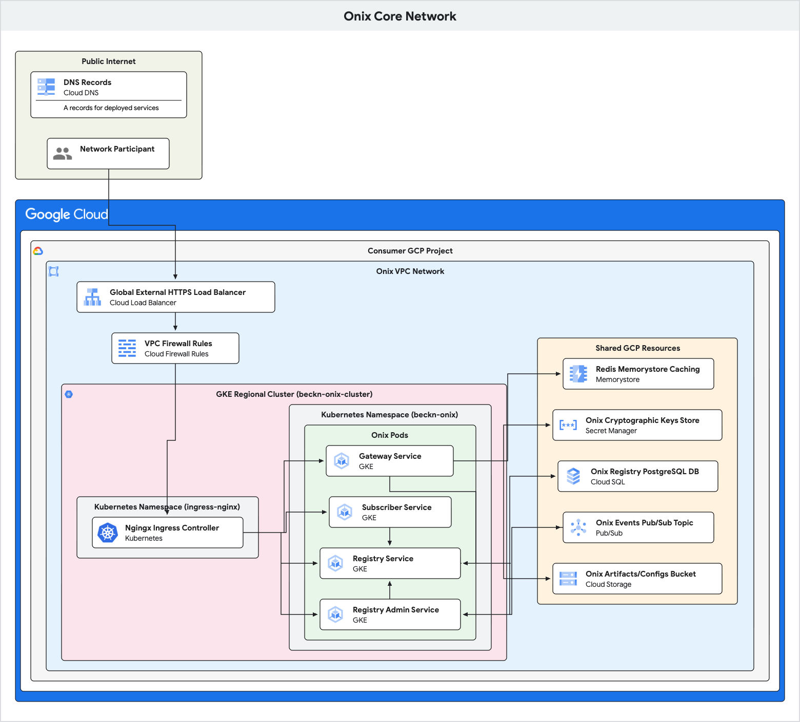

# GCP BECKN-ONIX

This project contains the core components for setting up a Beckn-compliant network, including the Registry, Gateway, BAP Adapter and BPP Adapter. It provides a foundational framework to facilitate seamless interaction and data exchange within the Beckn Protocol ecosystem.

## High-Level Architecture

Beckn-Onix is a cloud-native, microservices-based implementation of the Beckn protocol, designed to run on Google Cloud. It provides a robust and scalable foundation for building and operating a decentralized network.

The system is composed of several containerized Go microservices running on Google Kubernetes Engine (GKE), which are deployed using the [**Onix installer**](./deploy/onix-installer/README.md).

-   **Services**: The core logic is implemented in a set of Go microservices (Gateway, Registry, etc.).
-   **Communication**: Services communicate synchronously via RESTful APIs and asynchronously through Google Cloud Pub/Sub for event-driven workflows.
-   **Data Persistence**: The Registry relies on a Cloud SQL database to store network participant data.
-   **Caching**: Redis is used for caching cryptographic keys and other frequently accessed data to improve performance.

### Onix Architecture Diagrams

**1. Core Onix Network (Admin, Gateway, Registry, Subscriber)**

---

**2. Network Participant**

---

### Technology Stack

-   **Backend Services**: Go
-   **Installer**: FastAPI (Python) backend, Angular (TypeScript) frontend
-   **Infrastructure as Code**: Terraform
-   **Application Deployment**: Helm
-   **Containerization**: Docker
-   **Orchestration**: Google Kubernetes Engine (GKE)
-   **Database**: Cloud SQL for PostgreSQL
-   **Messaging**: Google Cloud Pub/Sub
-   **Caching**: Google Cloud Memorystore for Redis

---

## Core Services & API Endpoints

Below is a detailed description of each core service and its primary API endpoints.

### 1. Gateway

The Gateway acts as the network's central message router. It decouples BAPs and BPPs, handling the fan-out of requests (like `search`) and the routing of subsequent messages. It relies on the Registry to determine BPPs to send messages.

The Gateway exposes endpoints for Beckn actions. The specific action is determined by the request body's `context.action` field.

| Method | Path         | Description                                                                                                                                                           |
| :----- | :----------- | :-------------------------------------------------------------------------------------------------------------------------------------------------------------------- |
| `POST` | `/search`    | Handles the initial discovery request from a BAP.                                                                                                                     |
| `POST` | `/on_search` | Receives `on_search` responses from BPPs and forwards them to the originating BAP.                                                                                      |
| `GET`  | `/health`    | Returns the health status of the service.                                                                                                                             |

### 2. Registry

The Registry is the authoritative directory for the network. It stores and serves information about all trusted participants. Its key responsibility include: 
* Storing public keys and network addresses of registered entities.
* Enabling discovery of network participants by other components.
* Ensuring the authenticity and security of communication within the network through cryptographic verification.

| Method | Path                           | Description                                                                                                |
| :----- | :----------------------------- | :--------------------------------------------------------------------------------------------------------- |
| `POST` | `/subscribe`                   | Submits a subscription request from a new network participant. This initiates an asynchronous approval flow. |
| `PATCH`  | `/subscribe`                   | Submits an update request for an existing network participant's details.                                   |
| `POST` | `/lookup`                      | Queries the registry to find network participants based on specified criteria (e.g., domain, type).          |
| `GET`  | `/operations/{operation_id}` | Retrieves the status of a long-running operation, such as a subscription request (`SUBSCRIBED`, `PENDING`).  |
| `GET`  | `/health`                      | Returns the health status of the service.                                                                  |

### 3. Registry Admin

This service is the brain behind the participant lifecycle management. It operates asynchronously, consuming events from a message queue to process subscription requests, issue cryptographic challenges to verify participants, and ultimately approve or reject them.

| Method | Path                 | Description                                                                                                                                                              |
| :----- | :------------------- | :----------------------------------------------------------------------------------------------------------------------------------------------------------------------- |
| `POST` | `/operations/action` | An internal-facing endpoint, triggered by a Pub/Sub event. It processes subscription LROs, sending challenges and updating participant status in the Registry.             |
| `GET`  | `/health`            | Returns the health status of the service.                                                                                                                                |

### 4. Subscriber

The Subscriber service provides a standardized API for any network participant (BAP, BPP, Gateway) to join the network. It handles the complexities of generating keys, submitting subscription requests to the Registry, and managing the challenge-response verification process.

| Method | Path             | Description                                                                                                                                                           |
| :----- | :--------------- | :-------------------------------------------------------------------------------------------------------------------------------------------------------------------- |
| `POST` | `/subscribe`     | Initiates a subscription request to the Beckn Registry on behalf of a network participant.                                                                            |
| `PATCH`  | `/subscribe`     | Initiates an update to a participant's subscription details in the Registry.                                                                                          |
| `POST` | `/updateStatus`  | Checks the status of a subscription request by polling the Registry.                                                                                                  |
| `POST` | `/on_subscribe` | The callback endpoint that receives the encrypted challenge from the Registry Admin. It must decrypt the challenge and return the correct answer to be approved. |
| `GET`  | `/health`        | Returns the health status of the service.                                                                                                                             |

### 5. Adapter (BAP/BPP)

The Adapter is the interface between a traditional client application and the Beckn network. It acts as a translator, converting standard API calls into Beckn-compliant messages and vice-versa. It also handles the cryptographic signing and verification required for all network communication.

You can refer to its implementation here - [Beckn-Onix](https://github.com/Beckn-One/beckn-onix)

#### The Onix Installer can also deploy these adapters (along with their configured plugins), which can be configured to act as a BAP (Buyer App), a BPP (Provider App), or both, depending on the user's needs during the installation process.

---

## Configuration

All Onix services are configured using YAML files. These files control everything from server ports and logging levels to database connections and timeouts. For a detailed reference of all available parameters for each service, please see the **[Onix Configuration README](./configs/README.md)**.

---

## `onixctl`: The Build & Packaging Tool

onixctl is a command-line utility that prepares the Onix services and plugins for deployment. It reads a `source.yaml` file to understand the project structure, then automates the build and packaging process. Its key functions are:

-   **Building Go Plugins**: Compiles adapter plugins into shared object (`.so`) files.
-   **Building Docker Images**: Builds and pushes the Docker images for all microservices.
-   **Packaging Artifacts**: Zips the compiled plugins into a deployable bundle for the installer if adapter is being deployed.

## Plugin Architecture

The Onix adapter is designed to be extensible and is based on plugin framework. You can add custom functionality without modifying the core adapter code by creating/switching and configuring plugins. Refer to this - [BECKN-ONIX Plugin Framework](https://github.com/Beckn-One/beckn-onix/blob/main/pkg/plugin/README.md).

The following plugins are included with the GCP Onix:

-   [`cachingsecretskeymanager`](./plugins/cachingsecretskeymanager/README.md): Caches cryptographic keys in redis to reduce latency.
-   [`inmemorysecretkeymanager`](./plugins/inmemorysecretkeymanager/README.md): Caches cryptographic keys in a local in-memory store.
-   [`pubsubpublisher`](./plugins/pubsubpublisher/README.md): Publishes Beckn messages to a Google Cloud Pub/Sub topic for asynchronous processing.
-   [`rediscache`](./plugins/rediscache/README.md): Provides a distributed caching layer using Cloud Memorystore Redis.
-   [`secretskeymanager`](./plugins/secretskeymanager/README.md): Manages cryptographic keys using a secure secret store like Google Secret Manager.

---

## Deployment (BECKN Onix GCP Installer)

The entire Onix suite is deployed using this UI-based installer that automates and abstracts the entire process. The installer handles:

1.  **Infrastructure Provisioning**: Uses Terraform to create the necessary GCP resources (GKE clusters, Cloud SQL, etc.).
2.  **Application Deployment**: Uses Helm to deploy the Onix microservices onto the GKE cluster.

For detailed prerequisites and step-by-step instructions, please refer to the **[Installer README](./deploy/onix-installer/README.md)**.